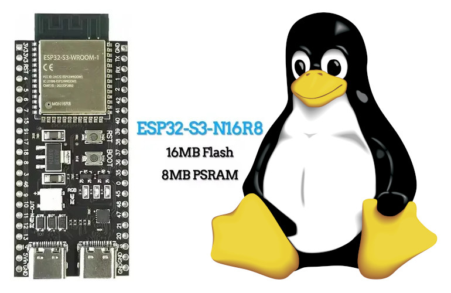

# 🐧 ESP32 Running Linux via RISC-V Emulator
This project implements a RISC-V emulator on the ESP32 microcontroller, capable of running a minimal Linux environment.

# 📄 Overview
This project enables the execution of a lightweight Linux environment on the ESP32 by emulating RISC-V instructions. It leverages the ESP32's capabilities to support basic Linux functionalities—ideal for experimentation, learning, or running simple applications that traditionally require more robust hardware.

# ⚙️ How It Works
The emulator translates RISC-V instructions into instructions compatible with the ESP32, allowing the system to simulate a RISC-V processor environment and run a minimal Linux kernel.

[](https://youtu.be/RffAsl98R4o?si=HZfnRIMDvLjHM8QV)

# 💻 Flashing and Setup
1. Create the Filesystem Image (It's there already)

```
mklittlefs -c data -b 4096 -p 256 -s $((8*1024*1024)) littlefs.bin
```
2. Flash the Filesystem

```
esptool.py -b 1500000 write_flash 0x100000 littlefs.bin
```
3. Build and Flash the Firmware

```
idf.py flash monitor
```

> [!NOTE]
> Make sure your ESP-IDF environment is correctly set up before starting.
> Tested with ESP32-S3 and a 16MB flash configuration.
> The Linux environment is minimal and designed for embedded purposes.