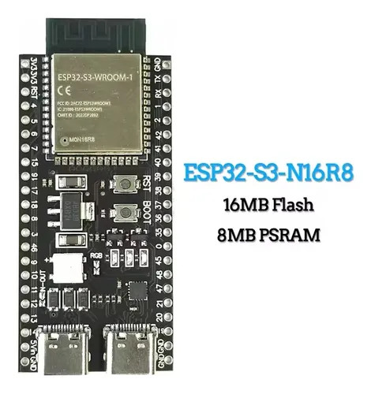

# RISC-V Linux Emulator for ESP32
This project implements a RISC-V emulator on the ESP32 microcontroller, capable of running a minimal Linux environment.

# Description
This project allows you to run a lightweight Linux environment on the ESP32, leveraging its processing power for applications traditionally requiring a more robust operating system.

The emulator translates RISC-V instructions into ESP32-compatible instructions, enabling the execution of basic Linux functionalities.

